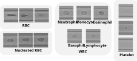
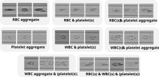

# Single-cell-and-aggregate-classification

This repository contains Python code for classifying single blood cells and blood cell aggregates in images acquired with a [deformability cytometry](https://mpl.mpg.de/divisions/cell-physics/methods/deformability-cytometry) device.

The repository accompanies the following paper: Zingman et al., [*Multi-label versus multi-class classification of blood cells and their aggregates in microfluidic channels* (2026)](https://arxiv.org/abs/2609.07410)

The paper compares multi-class and multi-label classification approaches and shows the advantages of the latter when various cell aggregates need to be identified.

**Single blood cells**

**Blood cell aggregates**


## Project organization

- `train.py` - training entry point
- `evaluate.py` - evaluation entry point for trained models
- `configurations/` - YAML configuration files for experiments
- `src/dcml/` - core package for data handling, modeling, training, and evaluation utilities
- `src/deepclassifier/` - project-specific helper and evaluation modules
- `data/` - local dataset directory

## Requirements

Minimal requirements to run training and evaluation:

- Linux (recommended)
- Tested with Python 3.12.5
- Expected to work with Python 3.10-3.12; newer versions may also work but are not tested
- Conda (Miniconda or Anaconda)
- NVIDIA GPU with CUDA support (optional, but recommended for training)

Main Python packages used by this project include:

- `torch`
- `torchvision`
- `numpy`
- `pandas`
- `scipy`
- `pyyaml`
- `python-dotenv`
- `mlflow`
- `dclab`
- `dcnum`
- `h5py`
- `tabulate`

## Installation

Run all commands from the project root directory.

Create and activate a conda environment:

```bash
conda create -n dc_env python=3.12 -y
conda activate dc_env
```

Install PyTorch (select the command matching your CUDA version from the official PyTorch website), then install the remaining packages:

```bash
pip install torch torchvision
pip install numpy pandas scipy pyyaml python-dotenv mlflow dclab dcnum h5py tabulate
```

## Setting up the dataset

The accompanying data (in `.rtdc` format) can be downloaded from [Open Science Framework](https://osf.io/3zkvw/).
The `.rtdc` files can be browsed using the [DCscope (formerly Shape-Out)](https://shapeout2.readthedocs.io/) tool.

Place the data in the project folder `data/` (or use another location and pass it via the corresponding arguments when running training or evaluation).

## Training and evaluation

Run all commands from the project root directory.

To train the model, run:

```bash
python train.py --param_file ./configurations/configuration_paper_MTL.yaml --data_path ./data/ --data_path_gmm_eval_in ./data/WBCtest_data/ --data_path_gmm_eval_out ./predictions_temp/
```

You can choose a specific configuration file from `configurations/`. Each file corresponds to a specific experiment described in the paper. You can create your own configuration file by copying and modifying an existing one.

Evaluation on `test_data` and `WBCtest_data` runs automatically after training.

To evaluate an already trained model separately, run:

```bash
python evaluate.py --path_in ./data/ --model MLFLOW_RUN_ID --path_in_gmm ./data/WBCtest_data/ --path_out_gmm_pred ./predictions_temp/
```

`MLFLOW_RUN_ID` is a run ID in the MLflow dashboard. It is also stored after training in `run_uuid.txt` in the project folder.
The evaluation script currently loads the saved model artifact (*best_model_bal_acc*)  from the specified MLflow run.

By default, results are tracked in `./mlflowruns/`, as defined by `MLFLOW_TRACKING_URI` in `.env` file. You can change this location by editing `.env`.
To view the MLflow dashboard, run: `mlflow ui --backend-store-uri ./mlflowruns/` and open the displayed URL in a browser.

## Acknowledgments

Part of this code (initial infrastructure, multi-class classification) was originally developed with contributions from former colleagues:
 - Maximilian Schlögel
 - Nadia Sbaa


